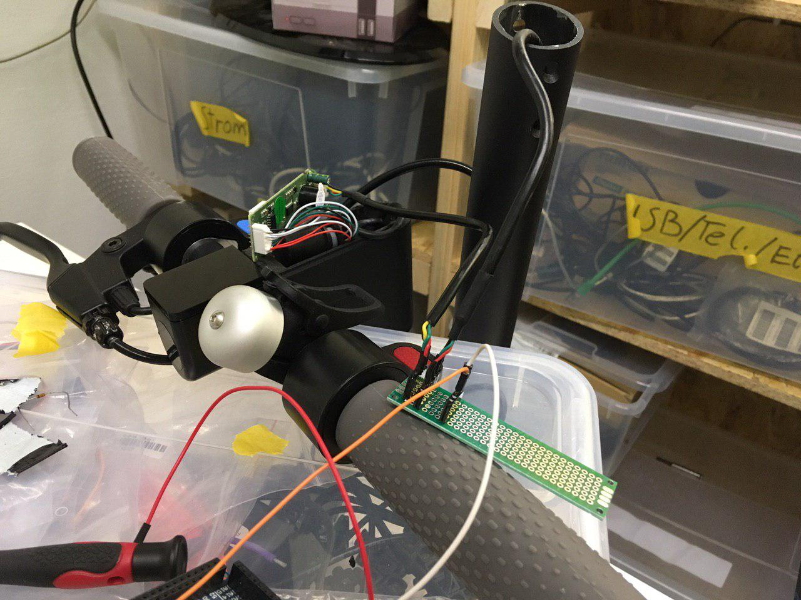
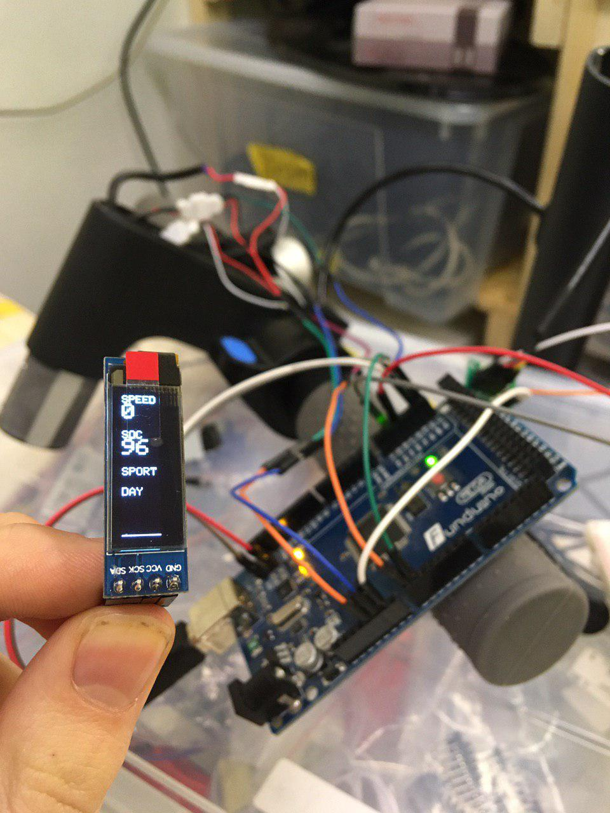
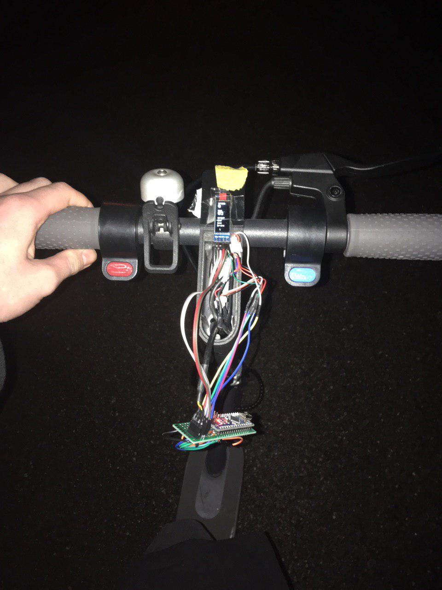
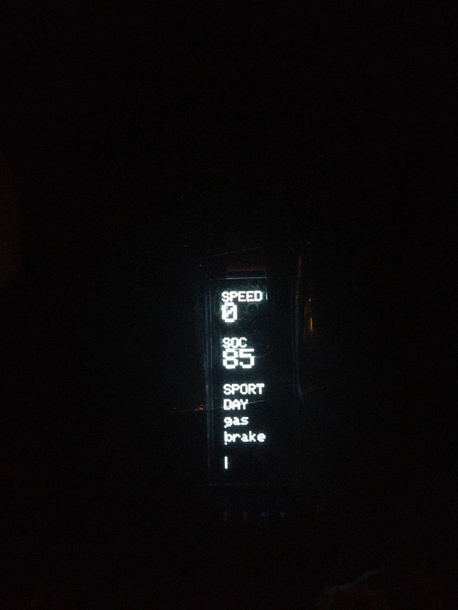

# DocGreenESA5000-Dashboard

This repository contains some utilities and selfmade documentation of the
DocGreen ESA 5000 sold by Lidl in December 2019. Lidl also sold the Explorer ESA
1919, which looks similar, but i can't promise its the same internally.
The scooter is similar to the Xiami M365 however there are some differences:
- the lights are mounted elsewhere
- the light does not change when braking
- it has no bluetooth (i count that as a plus)
- it has a "Zulassung nach eKFV" making it legal to drive on german roads when
equipped with an insurance license plate
- the internal communication uses the same addressing layer, but the addresses
and contents are different.

## In this repository

- [docgreen-protocol.txt](docgreen-protocol.txt): a list of bus messages and the meaning of some of the bytes
- [MegaSniffer](MegaSniffer/): a small arduino program to sniff the internal bus using an Arduino Mega
- [sniffs](sniffs/): a set of labeled sniffs
- [DocGreenDisplay](DocGreenDisplay/): a replacement for the stock head unit using an arduino nano and
a 128x32 OLED display.

## Further Reading

- https://github.com/augisbud/m365_dashboard you will need the circuit listed
under "Physical Connections" if you want to use DocGreenDisplay.
- https://github.com/etransport/ninebot-docs/wiki/protocol M365 protocol documentation.
- https://github.com/camcamfresh/Xiaomi-M365-BLE-Controller-Replacement
- https://scooterhacking.org/

## Pictures

