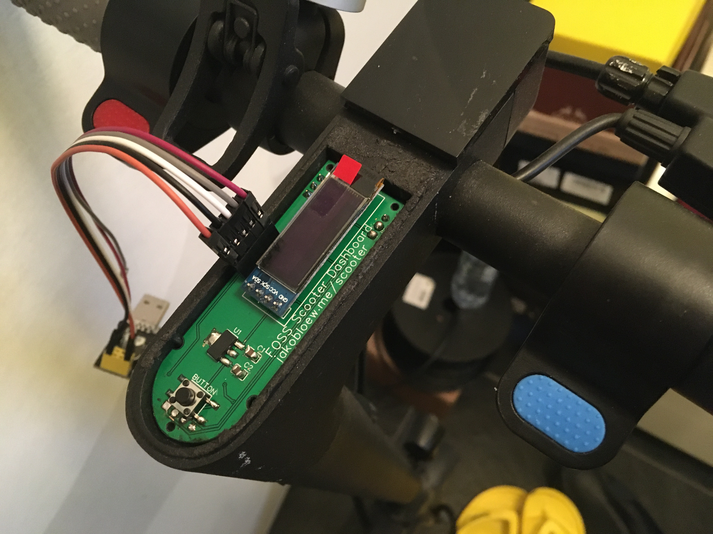
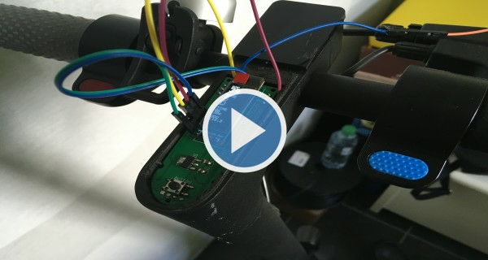
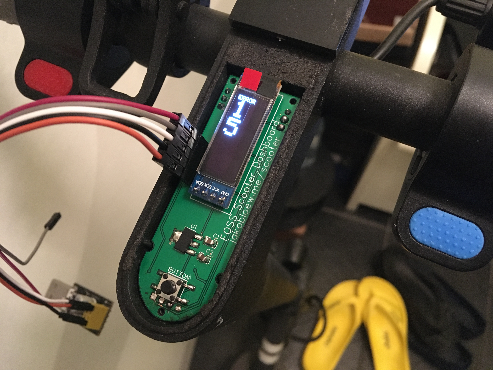
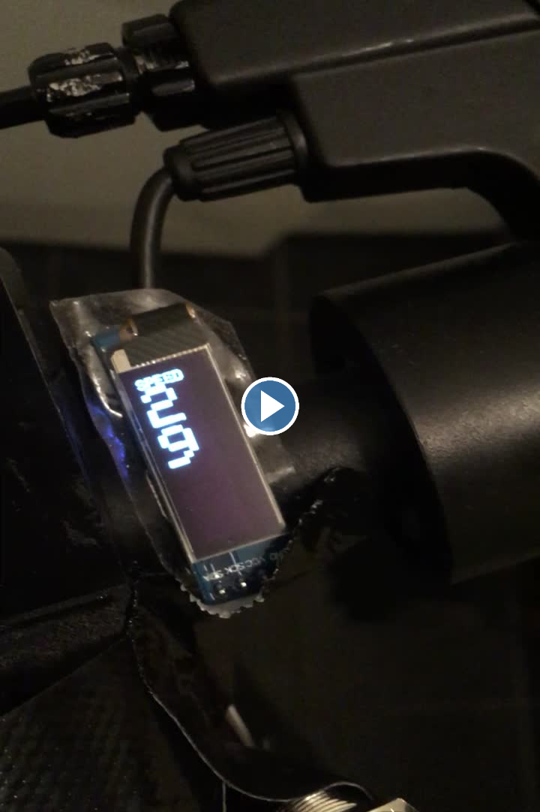

# DocGreenESA5000-Dashboard

This repository contains some utilities and selfmade documentation of the
DocGreen ESA 5000 sold by Lidl in December 2019. Lidl also sold the Explorer ESA
1919, which looks similar, but i can't promise its the same internally.
The scooter is similar to the Xiaomi M365 however there are some differences:
- the lights are mounted elsewhere
- the light does not change when braking
- it has no bluetooth (i count that as a plus)
- it has a "Zulassung nach eKFV" making it legal to drive on german roads when
equipped with an insurance license plate
- the internal communication uses the same addressing layer, but the addresses
and contents are different.

## In this repository

- [docgreen-protocol](docgreen-protocol.md): a list of bus messages and the meaning of some of the bytes
- [MegaSniffer](MegaSniffer/): a small arduino program to sniff the internal bus using an Arduino Mega
- [sniffs](sniffs/): a set of labeled sniffs
- [DocGreenDisplay](DocGreenDisplay/): a replacement for the stock head unit using an arduino nano and
a 128x32 OLED display.

## Dashboard PCB

The initial solution was a perfboard + Arduino Nano + diode & resistor solution using
[this circuit](pictures/circuit.svg). It worked well, but was too large to fit into the dashboard place.
Thus, after using a duct tape solution for a few months i decided to create a custom PCB with the same
size as the original dashboard. Below shows an old version of the PCB in the scooter housing connected
to a USB programmer.

## Further Reading

- https://github.com/augisbud/m365_dashboard
- https://github.com/etransport/ninebot-docs/wiki/protocol M365 protocol documentation.
- https://github.com/camcamfresh/Xiaomi-M365-BLE-Controller-Replacement
- https://scooterhacking.org/

## Pictures

## LICENSE

This project is free software: you can redistribute it and/or modify
it under the terms of the GNU General Public License as published by
the Free Software Foundation, either version 3 of the License, or
(at your option) any later version.

This project is distributed in the hope that it will be useful,
but WITHOUT ANY WARRANTY; without even the implied warranty of
MERCHANTABILITY or FITNESS FOR A PARTICULAR PURPOSE.  See the
GNU General Public License for more details.

You should have received a copy of the GNU General Public License
along with this project.  If not, see <https://www.gnu.org/licenses/>.
